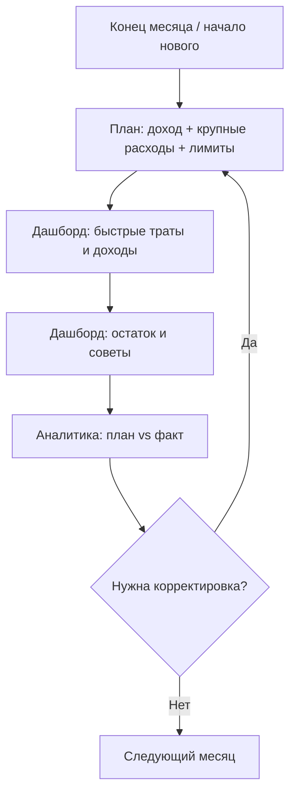

# Семейный бюджет — полное описание проекта

Документ для семьи из двух человек: как устроено приложение, как им пользоваться и как оно развёрнуто.

**Production:** https://194.154.29.93  
**Репозиторий:** https://github.com/avdealex360/fin-home

---

## Содержание

1. [Зачем это приложение](#1-зачем-это-приложение)
2. [Метод 50/30/20](#2-метод-503020)
3. [Архитектура](#3-архитектура)
4. [Ежемесячный цикл (бизнес-процесс)](#4-ежемесячный-цикл-бизнес-процесс)
5. [Разделы интерфейса](#5-разделы-интерфейса)
6. [Данные и сущности](#6-данные-и-сущности)
7. [Советы и правила](#7-советы-и-правила)
8. [Вклад и калькулятор](#8-вклад-и-калькулятор)
9. [Telegram](#9-telegram)
10. [Развёртывание](#10-развёртывание)
11. [Локальная разработка](#11-локальная-разработка)
12. [Структура репозитория](#12-структура-репозитория)

---

## 1. Зачем это приложение

**fin-home** — личный веб-сервис для семейного бюджета. Не банк и не облачный SaaS: данные лежат в SQLite на вашем VPS, доступ по паролю.

Основные задачи:

- планировать доход и расходы по методу **50/30/20**;
- фиксировать фактические операции (доходы и траты);
- отслеживать **долги** (кредитка, Сплит) и **цели** (подушка, вклад, машина);
- считать **прогноз вклада** с капитализацией;
- смотреть **аналитику** «план vs факт»;
- получать **советы**, когда бюджет уходит в красную зону.

Приложение рассчитано на **мобильный телефон**: крупные кнопки, нижняя навигация, формы без Enter для сохранения.

---

## 2. Метод 50/30/20

Доход месяца делится на три группы:

| Группа | Доля | Примеры категорий |
|--------|------|-------------------|
| **Нужды** (needs) | 50% | Аренда, продукты, транспорт, здоровье, кредитка, Сплит |
| **Желания** (wants) | 30% | Рестораны, подписки, одежда, подарки |
| **Сбережения** (savings) | 20% | Подушка, вклад, досрочное погашение долгов |

На странице **План** можно:

- задать **ожидаемый доход**;
- распределить **лимиты по категориям** вручную;
- нажать **«Пересчитать 50/30/20 автоматически»** — лимиты заполнятся равномерно внутри каждой группы.

**Плановые крупные расходы** (аренда, операция кота, разовые платежи) и **плановые взносы по долгам** вносятся в Плане отдельно — не через отдельную страницу «Новая операция».

---

## 3. Архитектура

### Стек

| Слой | Технология |
|------|------------|
| Backend | Python 3.12, FastAPI |
| БД | SQLite, SQLAlchemy, Alembic |
| Frontend | Jinja2, HTMX, Tailwind CDN, Chart.js |
| Auth | HTTP Basic Auth |
| Production | Docker Compose, Caddy (HTTPS) |
| CI/CD | GitHub Actions → SSH deploy |

### Схема production

```
Браузер / Telegram
        │
        ▼
   Caddy :443  (TLS, self-signed cert для IP)
        │
        ▼
  budget-app :8000  (FastAPI + uvicorn)
        │
        ▼
  ./data/budget.db  (SQLite на диске VPS)
```

### Ключевые модули

```
app/
├── main.py              # FastAPI, lifespan, миграции, seed
├── migrations.py        # Alembic upgrade / stamp
├── models/              # SQLAlchemy-модели
├── routers/             # HTTP-эндпоинты и страницы
├── services/            # Бизнес-логика
│   ├── dashboard.py     # Сводка месяца, 50/30/20
│   ├── plan.py          # План, лимиты, плановые расходы
│   ├── rules.py         # Движок советов
│   ├── analytics.py     # План vs факт, графики
│   ├── deposit_calc.py  # Калькулятор вклада
│   └── exchange.py      # Курсы EUR/RUB, EUR/USD
├── templates/           # HTML-шаблоны
└── static/style.css     # Mobile-first стили
```

---

## 4. Ежемесячный цикл (бизнес-процесс)

Типичный сценарий использования:



### Шаг 1. Планирование (начало месяца или заранее)

1. Открыть **План** → переключить месяц стрелками ← → (можно планировать **следующий** месяц).
2. Добавить **плановые крупные расходы** (аренда, ветеринар и т.д.).
3. Добавить **плановые взносы по долгам**.
4. Указать **ожидаемый доход** → «Пересчитать 50/30/20» или отредактировать лимиты вручную → **Сохранить план**.

### Шаг 2. Ежедневный учёт

1. **Дашборд** → блок «Быстрая запись»: сумма, категория, комментарий → **Записать**.
2. Для **дохода** — выбрать income-категорию; при необходимости указать сумму в **EUR**.
3. Редактирование старых операций — через список «Последние операции» → изменить.

### Шаг 3. Контроль

1. **Дашборд** — доход/расход/остаток, прогресс 50/30/20, долги, цели, советы.
2. **Аналитика** — таблица план vs факт, топ категорий, накопительный график.

### Шаг 4. Долги и цели

1. **Настройки** — правка долгов, платежи по кредитке/Сплит, категории, курсы валют, экспорт.
2. **Цели** — подушка, вклад, машина: целевая сумма, текущий прогресс, ежемесячный взнос.

### Шаг 5. Вклад

1. **Вклад** — актуальный баланс, ставка, график ставок, калькулятор «что будет через N месяцев».

---

## 5. Разделы интерфейса

### Навигация

**Десктоп:** верхнее меню — Дашборд, План, Аналитика, Вклад, Цели, Настройки.

**Телефон:** нижняя панель — Дашборд, План, Вклад, Аналитика, Ещё (→ Настройки).

### Дашборд `/`

- Сводка месяца: доход, потрачено, остаток, EUR-эквивалент дохода.
- Полоски **50/30/20** по группам (нужды / желания / сбережения).
- Блок **долгов** с остатком и минимальным платежом.
- Блок **целей** с прогресс-барами.
- **Советы** от RuleEngine (лимиты, кредитка, подушка и др.).
- **Быстрая запись** операции.
- **Последние операции** с удалением/редактированием.

### План `/plan` или `/plan/{год}/{месяц}`

- Переключатель месяца (← →), ссылка «Открыть следующий месяц».
- **Плановые крупные расходы** — список + форма добавления.
- **Плановые взносы по долгам**.
- **Лимиты 50/30/20** по категориям.
- Кнопки «Сохранить план» и «Пересчитать автоматически».

### Аналитика `/analytics`

- Выбор года/месяца.
- Таблица **план vs факт** по категориям.
- **Топ-5** категорий расходов.
- **Накопительный график** доходов/расходов/сбережений.
- Динамика **отдельной категории** за 6 месяцев.

### Вклад `/deposit`

- Настройки: баланс, ставка, день капитализации, дата открытия, разовый взнос, JSON-график ставок.
- **Калькулятор** с кнопкой «Рассчитать».
- График капитализации, таблица помесячно.

Формула: **(остаток + взнос) × (1 + ставка/12)** — проценты на взнос в том же месяце.

### Цели `/goals`

- Список целей (подушка 150k, вклад 1.5M, машина).
- Пополнение, редактирование целевой суммы и ежемесячного взноса.

### Настройки `/settings`

- Имена пользователей, курсы **EUR/RUB** и **EUR/USD** (обновление с Frankfurter API).
- **Долги**: добавление, закрытие, регистрация платежа.
- **Категории** расходов.
- **Экспорт** JSON и CSV.

---

## 6. Данные и сущности

### Основные таблицы

| Сущность | Назначение |
|----------|------------|
| `Transaction` | Факт: доход / расход / перевод |
| `Category` | Категория (needs/wants/savings/income) |
| `MonthlyPlan` | План на месяц (год + месяц) |
| `CategoryLimit` | Лимит категории в рамках плана |
| `PlannedExpense` | Крупный плановый расход |
| `PlannedDebtPayment` | Плановый взнос по долгу |
| `Debt` | Долг (кредитка, сплит, кредит) |
| `DebtPayment` | Фактический платёж по долгу |
| `Goal` | Цель накопления |
| `GoalContribution` | Пополнение цели |
| `DepositSnapshot` | История снимков вклада |
| `Setting` | Key-value настройки (курсы, параметры вклада) |

### Предзаполнение (seed)

При первом запуске создаются:

- **18 категорий расходов** + **3 income-категории**;
- **2 долга**: кредитка Тинькофф, Яндекс Сплит;
- **3 цели**: подушка 150k, вклад 1.5M, машина;
- настройки вклада (ставки, дата открытия, разовый взнос 450k).

Данные лежат в `data/budget.db`. При деплое **не перезаписываются** — volume на хосте.

---

## 7. Советы и правила

`RuleEngine` (`app/services/rules.py`) проверяет состояние бюджета и показывает советы на дашборде:

| Правило | Когда срабатывает |
|---------|-------------------|
| Лимит категории | Потрачено > 80% лимита |
| Нет плана | План месяца не заполнен |
| Мало сбережений | Факт сбережений ниже 20% дохода |
| Кредитка | Льготный период / высокая нагрузка |
| Подушка | Достижение 150k (одноразовое уведомление) |
| Крупные траты | Аномально высокий расход в категории |

---

## 8. Вклад и калькулятор

Параметры вклада хранятся в `Setting`:

- `deposit_balance`, `deposit_rate`, `deposit_cap_day`
- `deposit_start_date`, `deposit_initial_lump`
- `deposit_rate_schedule` — JSON с датами смены ставки

Калькулятор строит помесячную таблицу и график до целевой суммы (1.5M по умолчанию).

---

## 9. Telegram

Опционально. В `.env`:

```env
TELEGRAM_BOT_TOKEN=...
TELEGRAM_ALLOWED_IDS=123456789
```

Команды бота:

| Команда | Действие |
|---------|----------|
| `/add 1500 продукты` | Расход |
| `/income 50000 зарплата` | Доход |
| `/balance` | Сводка месяца |

Webhook: `POST /telegram/webhook` (нужен **домен** с Let's Encrypt; по IP с self-signed не заработает).

Уведомления по cron: `make notify` или `scripts/notify.py`.

---

## 10. Развёртывание

### Production-сервер

| Параметр | Значение |
|----------|----------|
| VPS | 194.154.29.93, Ubuntu 24.04 |
| Путь | `/opt/fin-home` |
| Пользователь | `deploy` |
| URL | https://194.154.29.93 |
| HTTPS | Self-signed сертификат (`scripts/gen-certs.sh`) |

### Быстрый старт на VPS

```bash
# root, один раз
git clone https://github.com/avdealex360/fin-home.git /opt/fin-home
cd /opt/fin-home && make vps-setup

# deploy
make setup && nano .env
make prod-up          # создаёт certs/ и поднимает Caddy + app
make prod-migrate
make prod-check
```

### Автодеплой (GitHub Actions)

```
git push origin main  →  Actions  →  SSH deploy@VPS  →  make deploy
```

**Обязательные Secrets** (Settings → Secrets → Actions):

| Secret | Пример |
|--------|--------|
| `VPS_HOST` | `194.154.29.93` |
| `VPS_USER` | `deploy` |
| `VPS_SSH_KEY` | приватный SSH-ключ |

Без `VPS_HOST` workflow падает с `missing server host`.

После push проверьте: GitHub → Actions → **Deploy** → зелёный статус → `make prod-check` на VPS.

Подробная настройка: **[DEPLOY.md §3–5](DEPLOY.md#шаг-3-ssh-ключ-для-github-actions)**

### Важно

- На VPS **не** использовать `make rebuild` — только `make prod-rebuild`.
- `tls internal` в Caddy **не работает** для IP — используется `certs/cert.pem`.
- `.env` и `data/` **не в git**.

Подробнее: **[DEPLOY.md](DEPLOY.md)**

---

## 11. Локальная разработка

```bash
make setup
make up              # Docker → http://127.0.0.1:8000
# или
make install && make dev
```

Логин/пароль — из `.env` (`APP_USER`, `APP_PASSWORD`).

```bash
make test            # pytest (нужен pip install pytest)
make migrate-local   # миграции без Docker
make backup          # дамп SQLite
```

Все команды: **`make help`** → **[MAKEFILE.md](MAKEFILE.md)**

---

## 12. Структура репозитория

```
fin-home/
├── app/                    # Приложение FastAPI
├── alembic/                # Миграции БД
├── docs/
│   ├── README.md           # Индекс документации
│   ├── PROJECT.md          # ← этот файл
│   ├── DEPLOY.md           # Деплой на VPS
│   └── MAKEFILE.md         # Команды make
├── scripts/
│   ├── deploy.sh           # Деплой на сервере
│   ├── gen-certs.sh        # TLS-сертификат для IP
│   ├── prod-check.sh       # Диагностика prod
│   ├── vps-setup.sh        # Первичная настройка VPS
│   ├── install-compose.sh  # Docker Compose на VPS
│   ├── backup.sh           # Бэкап SQLite
│   └── notify.py           # Telegram-уведомления
├── .github/workflows/
│   └── deploy.yml          # GitHub Actions
├── Caddyfile               # Reverse proxy + HTTPS
├── docker-compose.yml      # Локальная разработка
├── docker-compose.prod.yml # Production (+ Caddy)
├── Makefile
├── Dockerfile
├── .env.example
└── README.md
```

---

## Связанные документы

- [README.md](../README.md) — быстрый старт
- [docs/README.md](README.md) — индекс, чеклист, FAQ
- [DEPLOY.md](DEPLOY.md) — пошаговый деплой
- [MAKEFILE.md](MAKEFILE.md) — все команды `make`
