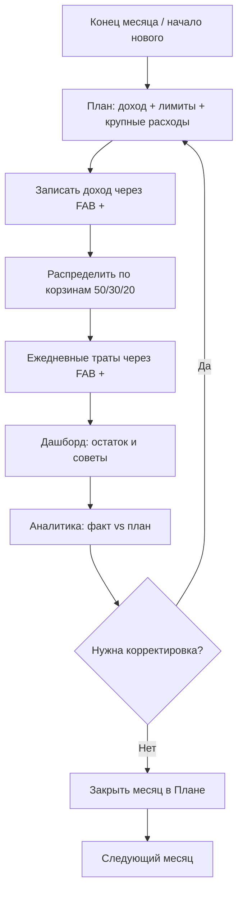

# Семейный бюджет — полное описание проекта

Документ для семьи: как устроено приложение, как им пользоваться и как оно развёрнуто.

**Production:** https://194.154.29.93  
**Репозиторий:** https://github.com/avdealex360/fin-home

> **v3 (июнь 2026):** Svelte 5 SPA + FastAPI JSON API. Старый HTMX/Jinja2-интерфейс заменён одностраничным приложением; backend отдаёт только JSON (кроме экспорта и статики).

---

## Содержание

1. [Зачем это приложение](#1-зачем-это-приложение)
2. [Метод 50/30/20 и два «пота»](#2-метод-503020-и-два-пота)
3. [Архитектура](#3-архитектура)
4. [Ежемесячный цикл (бизнес-процесс)](#4-ежемесячный-цикл-бизнес-процесс)
5. [Разделы интерфейса](#5-разделы-интерфейса)
6. [Данные и сущности](#6-данные-и-сущности)
7. [Советы и правила](#7-советы-и-правила)
8. [Вклад и калькулятор](#8-вклад-и-калькулятор)
9. [Развёртывание](#9-развёртывание)
10. [Локальная разработка](#10-локальная-разработка)
11. [Структура репозитория](#11-структура-репозитория)

---

## 1. Зачем это приложение

**fin-home** — личный веб-сервис для семейного бюджета. Не банк и не облачный SaaS: данные лежат в SQLite на вашем VPS, доступ по паролю (HTTP Basic Auth на Caddy).

Основные задачи:

- планировать доход и расходы по методу **50/30/20**;
- **распределять доход** по корзинам (нужды / желания / сбережения) с адресатами «Вклад» и «Копилки»;
- фиксировать фактические операции (доходы и траты);
- отслеживать **долги** (кредитка, Сплит, кредит) и **копилки** (расходуемые конверты);
- вести **вклад** (замороженная кубышка, только рост) с калькулятором капитализации;
- смотреть **аналитику** «план vs факт» и «Факт 50/30/20»;
- получать **советы**, когда бюджет уходит в красную зону.

Приложение рассчитано на **мобильный телефон**: нижняя навигация, bottom sheet для операций, устанавливается как **PWA**.

При первом запуске БД **пустая**: экран онбординга предложит загрузить **демо-данные** или **начать с чистого листа**. Ничего не захардкожено и не является неудаляемым.

---

## 2. Метод 50/30/20 и два «пота»

Доход месяца делится на три группы:

| Группа | Доля | Куда уходит |
|--------|------|-------------|
| **Нужды** (needs) | 50% | Категории обязательных расходов (аренда, продукты, транспорт, кредиты) |
| **Желания** (wants) | 30% | Категории необязательных трат + **копилки** группы «желания» |
| **Сбережения** (savings) | 20% | **Вклад** + **копилки** группы «сбережения» |

«Откладывание» — две разные кубышки:

- **Копилка** — расходуемый конверт: можно **отложить** и **потратить** (раздел «Ещё»).
- **Вклад** — замороженная кубышка: баланс **только растёт**, снять нельзя.

На странице **План**:

- задать **ожидаемый доход** и **лимиты по категориям**;
- нажать **«Подогнать под 50/30/20»** — лимиты пересчитаются пропорционально;
- добавить **плановые крупные расходы** и **плановые взносы по долгам**;
- **закрыть месяц**, когда учёт завершён.

Единый источник правды — **План**: дашборд и аналитика читают цифры из него.

---

## 3. Архитектура

### Стек

| Слой | Технология |
|------|------------|
| Frontend | Svelte 5, Vite, PWA (vite-plugin-pwa), Chart.js |
| Backend | Python 3.12, FastAPI (JSON API `/api/*`) |
| БД | SQLite, SQLAlchemy 2.x, Alembic |
| Auth | HTTP Basic Auth на Caddy (в коде приложения авторизации нет) |
| Production | Docker Compose, Caddy (HTTPS), multi-stage Dockerfile |
| CI/CD | GitHub Actions → SSH → `scripts/deploy.sh` |

### Схема production

```
Браузер / PWA
        │
        ▼
   Caddy :443  (TLS, self-signed cert для IP; Basic Auth)
        │
        ▼
  budget-app :8000  (FastAPI + собранный SPA из static_spa/)
        │
        ├── /api/*  → JSON
        └── /*      → index.html + assets (hash-routing: #/plan)
        │
        ▼
  ./data/budget.db  (SQLite на диске VPS)
```

### Маршрутизация frontend

Hash-based routing — сервер не нуждается в SPA fallback для каждого URL:

| Hash | Экран |
|------|-------|
| `#/` или `#/dashboard` | Главная (дашборд) |
| `#/plan` | План |
| `#/deposit` | Вклад |
| `#/analytics` | Аналитика |
| `#/more` | Ещё (настройки, копилки, долги) |
| `#/faq` | Как это работает |

### Ключевые модули backend

```
backend/app/
├── main.py              # FastAPI, lifespan (миграции + ensure_settings), mount SPA
├── migrations.py        # Alembic upgrade на старте
├── models/__init__.py   # Все SQLAlchemy-модели
├── serializers.py       # ORM → dict для JSON
├── seed.py              # ensure_settings + опциональные demo-данные (онбординг)
├── api/                 # Тонкие JSON-эндпоинты
│   ├── meta.py          # health, onboarding
│   ├── transactions.py
│   ├── allocation.py    # Распределение дохода
│   ├── plan.py
│   ├── deposit.py
│   ├── funds.py         # Копилки
│   ├── debts.py
│   ├── analytics.py
│   └── settings.py      # Настройки, экспорт
└── services/            # Бизнес-логика (без FastAPI)
    ├── dashboard.py
    ├── plan.py
    ├── allocation.py
    ├── sinking_funds.py
    ├── rules.py         # Движок советов
    ├── analytics.py
    ├── deposit_calc.py
    └── exchange.py
```

### Ключевые модули frontend

```
frontend/src/
├── App.svelte           # Онбординг, роутер, FAB + bottom sheet (операция / распределение)
├── lib/
│   ├── api.ts           # Типизированный клиент /api (синхронизировать с serializers.py)
│   ├── stores.ts        # period, route, toast, dataVersion (invalidate)
│   └── components/      # BottomSheet, TxForm, AllocationSheet, Chart, …
└── routes/
    ├── Dashboard.svelte
    ├── Plan.svelte
    ├── Deposit.svelte
    ├── Analytics.svelte
    ├── More.svelte
    └── Faq.svelte
```

Контракт frontend ↔ backend: TS-интерфейсы в `frontend/src/lib/api.ts` зеркалят `backend/app/serializers.py`.

---

## 4. Ежемесячный цикл (бизнес-процесс)



### Шаг 1. Планирование

1. **План** → переключить месяц стрелками ← →.
2. Добавить **плановые крупные расходы** и **плановые взносы по долгам**.
3. Указать **ожидаемый доход** → «Подогнать под 50/30/20» или отредактировать лимиты → **Сохранить**.

### Шаг 2. Доход и распределение

1. Нажать **+** (FAB) → **Доход** → сумма, категория.
2. Откроется **мастер распределения**: разложить сумму по корзинам (категории, копилки, вклад).
3. Счётчик «распределено / цель»; доход помечается `is_fully_allocated`, когда всё разложено.

### Шаг 3. Ежедневный учёт

1. **+** → **Расход** → сумма, категория, комментарий.
2. На дашборде видны корзины 50/30/20 и остаток месяца.

### Шаг 4. Копилки и долги

1. **Ещё** → **Копилки**: пополнить / потратить / редактировать.
2. **Ещё** → **Долги**: платежи, редактирование, закрытие.

### Шаг 5. Контроль и закрытие

1. **Аналитика** — «Факт 50/30/20», план vs факт, графики.
2. **План** → **Закрыть месяц**, когда учёт завершён.

---

## 5. Разделы интерфейса

### Навигация

**Телефон / PWA:** нижняя панель — **Главная**, **План**, **Вклад**, **Аналитика**, **Ещё**.

**FAQ** («Как это работает»): ссылка в «Ещё» и на экране онбординга (`#/faq`).

**FAB (+):** быстрая запись дохода или расхода; для дохода — переход к распределению.

### Главная `#/dashboard`

- Сводка месяца: доход, расход, остаток.
- Корзины **50/30/20** с целевыми долями.
- Блок **долгов** и **копилок**.
- **Советы** от RuleEngine.
- Нераспределённые доходы → кнопка «Распределить».

### План `#/plan`

- Переключатель месяца.
- **50/30/20-метр** (ожидаемый vs факт по группам).
- **Плановые крупные расходы** и **взносы по долгам**.
- **Лимиты по категориям** по группам.
- Кнопки «Сохранить план», «Подогнать под 50/30/20», «Закрыть месяц».

### Вклад `#/deposit`

- Баланс (только растёт), ставка, цель пополнения в месяц.
- **Пополнение** вручную или через распределение дохода.
- **Калькулятор** капитализации с графиком.

### Аналитика `#/analytics`

- Блок **«Факт 50/30/20»** (факт vs идеал 50/30/20).
- Таблица **план vs факт** по категориям.
- Топ категорий, накопительные графики.

### Ещё `#/more`

- **Копилки** — список, пополнение, трата, создание/удаление.
- **Долги** — список, платежи, редактирование.
- **Настройки** — имена пользователей, курс EUR/RUB.
- **Экспорт** JSON и CSV.
- Ссылка на FAQ.

### FAQ `#/faq`

Наглядные сценарии: два пота, распределение дохода, копилки, план, аналитика.

---

## 6. Данные и сущности

### Основные таблицы

| Сущность | Назначение |
|----------|------------|
| `Transaction` | Факт: доход / расход / перевод; `is_fully_allocated` для доходов |
| `IncomeAllocation` | Связь дохода с категорией, копилкой или вкладом (`to_deposit`) |
| `Category` | Категория (`needs`/`wants`/`savings`/`income`); `allocation_level` для мастера |
| `SinkingFund` | Копилка (`group`: wants \| savings); `is_rolling` для rolling-конвертов |
| `SinkingFundContribution` | Движение по копилке |
| `MonthlyPlan` | План на месяц; `is_closed` — закрытие месяца |
| `CategoryLimit` | Лимит категории в рамках плана |
| `PlannedExpense` | Крупный плановый расход |
| `PlannedDebtPayment` | Плановый взнос по долгу |
| `Debt` / `DebtPayment` | Долг и фактические платежи |
| `DepositSnapshot` | История снимков вклада |
| `DepositContribution` | Пополнение вклада (manual \| allocation) |
| `Setting` | Key-value настройки (курсы, параметры вклада, onboarded) |
| `AppUser` | Пользователи (имена в настройках) |

Модель **Goal** удалена в v3 — её роль выполняют **копилки** с `target_amount`.

### Предзаполнение (seed)

**При каждом старте** создаются только **настройки по умолчанию** (`ensure_settings`) — курсы, пустой вклад, флаг `onboarded`.

**Демо-данные** (категории, долги, копилки) загружаются **только по запросу** пользователя на экране онбординга. Все сущности редактируемы и удаляемы.

Данные лежат в `data/budget.db` на хосте (volume). При деплое **не перезаписываются**.

---

## 7. Советы и правила

`RuleEngine` (`backend/app/services/rules.py`) проверяет состояние бюджета и показывает советы на дашборде:

| Правило | Когда срабатывает |
|---------|-------------------|
| Лимит категории | Потрачено > 80% лимита |
| Нет плана | План месяца не заполнен |
| Мало сбережений | Факт сбережений ниже 20% дохода |
| Кредитка | Льготный период / высокая нагрузка |
| Крупные траты | Аномально высокий расход в категории |
| Ежеквартальный чекап | Напоминание пересмотреть копилки и 50/30/20 |

Rule Engine опирается на `Category.group`, `Debt.type` и флаг `to_deposit` — **не на названия категорий**.

---

## 8. Вклад и калькулятор

Параметры вклада хранятся в `Setting`:

- `deposit_balance`, `deposit_rate`, `deposit_cap_day`
- `deposit_start_date`, `deposit_initial_lump`
- `deposit_rate_schedule` — JSON с датами смены ставки
- `deposit_monthly_target` — цель пополнения в месяц

Калькulator строит помесячную таблицу и график капитализации.

Формула: **(остаток + взнос) × (1 + ставка/12)** — проценты на взнос в том же месяце.

---

## 9. Развёртывание

### Production-сервер

| Параметр | Значение |
|----------|----------|
| VPS | 194.154.29.93, Ubuntu 24.04 |
| Путь | `/opt/fin-home` |
| Пользователь | `deploy` |
| URL | https://194.154.29.93 |
| HTTPS | Self-signed сертификат (`scripts/gen-certs.sh`) |

### Быстрый старт на VPS

```bash
# root, один раз
git clone https://github.com/avdealex360/fin-home.git /opt/fin-home
cd /opt/fin-home && make vps-setup

# deploy
make setup && nano .env   # APP_USER, APP_PASSWORD_HASH, APP_SECRET
make hash-password p=ваш-пароль   # → вставить в APP_PASSWORD_HASH
make prod-up && make prod-check
```

Миграции Alembic применяются **автоматически при старте** приложения (`lifespan` в `main.py`). Отдельный `make prod-migrate` нужен только для ручного запуска или отладки.

### Автодеплой (GitHub Actions)

```
git push origin main  →  Actions  →  SSH deploy@VPS  →  scripts/deploy.sh
```

Скрипт деплоя: `git fetch && reset --hard origin/main` → `docker compose up -d --build` → `prod-check`. Миграции — при старте контейнера.

**Обязательные Secrets** (Settings → Secrets → Actions):

| Secret | Пример |
|--------|--------|
| `VPS_HOST` | `194.154.29.93` |
| `VPS_USER` | `deploy` |
| `VPS_SSH_KEY` | приватный SSH-ключ |

Подробная настройка: **[DEPLOY.md §3–5](DEPLOY.md#шаг-3-ssh-ключ-для-github-actions)**

### Важно

- На VPS **не** использовать `make rebuild` — только `make prod-rebuild`.
- `tls internal` в Caddy **не работает** для IP — используется `certs/cert.pem`.
- `.env`, `data/` и `certs/` **не в git**.

Подробнее: **[DEPLOY.md](DEPLOY.md)**

---

## 10. Локальная разработка

### Без Docker (два терминала)

```bash
make install
make dev-api    # → http://127.0.0.1:8000
make dev-web    # → http://127.0.0.1:5173  (Vite проксирует /api)
```

Открывайте **:5173** — там hot-reload frontend. API-документация: http://127.0.0.1:8000/api/docs

### Через Docker

```bash
make setup && make up    # → http://127.0.0.1:8000 (backend отдаёт собранный SPA)
```

Basic Auth на Caddy действует только в **production** (`docker-compose.prod.yml`). Локально пароль не требуется.

```bash
make test            # pytest
make migrate-local   # миграции без Docker
make backup          # дамп SQLite
```

Все команды: **`make help`** → **[MAKEFILE.md](MAKEFILE.md)**

---

## 11. Структура репозитория

```
fin-home/
├── backend/
│   ├── app/                 # FastAPI JSON API
│   ├── alembic/             # Миграции БД
│   ├── tests/
│   └── requirements.txt
├── frontend/                # Svelte 5 + Vite PWA
│   └── src/
├── docs/
│   ├── README.md            # Индекс документации
│   ├── PROJECT.md           # ← этот файл
│   ├── DEPLOY.md            # Деплой на VPS
│   └── MAKEFILE.md          # Команды make
├── scripts/
│   ├── deploy.sh            # Деплой на сервере
│   ├── gen-certs.sh         # TLS-сертификат для IP
│   ├── prod-check.sh        # Диагностика prod
│   ├── vps-setup.sh         # Первичная настройка VPS
│   ├── install-compose.sh   # Docker Compose на VPS
│   └── backup.sh            # Бэкап SQLite
├── .github/workflows/
│   └── deploy.yml           # GitHub Actions
├── Caddyfile                # Reverse proxy + HTTPS + Basic Auth
├── docker-compose.yml       # Локальная разработка
├── docker-compose.prod.yml  # Production (+ Caddy)
├── Dockerfile               # multi-stage: SPA build → backend image
├── Makefile
├── .env.example
└── README.md
```

---

## Связанные документы

- [README.md](../README.md) — быстрый старт
- [docs/README.md](README.md) — индекс, чеклист, FAQ
- [DEPLOY.md](DEPLOY.md) — пошаговый деплой
- [MAKEFILE.md](MAKEFILE.md) — все команды `make`
