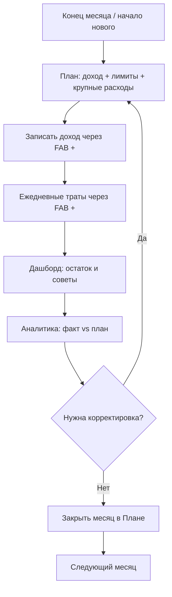

# Семейный бюджет — полное описание проекта

Документ для семьи: как устроено приложение, как им пользоваться и как оно развёрнуто.

**Production:** https://194.154.29.93  
**Репозиторий:** https://github.com/avdealex360/fin-home

> **v3 (июнь 2026):** Svelte 5 SPA + FastAPI JSON API. Старый HTMX/Jinja2-интерфейс заменён одностраничным приложением; backend отдаёт только JSON (кроме экспорта и статики).

---

## Содержание

1. [Зачем это приложение](#1-зачем-это-приложение)
2. [Метод 50/30/20 и два «пота»](#2-метод-503020-и-два-пота)
3. [Архитектура](#3-архитектура)
4. [Ежемесячный цикл (бизнес-процесс)](#4-ежемесячный-цикл-бизнес-процесс)
5. [Разделы интерфейса](#5-разделы-интерфейса)
6. [Данные и сущности](#6-данные-и-сущности)
7. [Советы и правила](#7-советы-и-правила)
8. [Вклад и калькулятор](#8-вклад-и-калькулятор)
9. [Развёртывание](#9-развёртывание)
10. [Локальная разработка](#10-локальная-разработка)
11. [Структура репозитория](#11-структура-репозитория)

---

## 1. Зачем это приложение

**fin-home** — личный веб-сервис для семейного бюджета. Не банк и не облачный SaaS: данные лежат в SQLite на вашем VPS, доступ по паролю (**вход на уровне приложения**: экран логина → cookie сессии).

Основные задачи:

- планировать доход и расходы по методу **50/30/20**;
- фиксировать фактические операции (доходы и траты), смотреть их все с фильтрами и диапазоном дат;
- отслеживать **долги** (кредитка, Сплит, кредит) и **копилки** (расходуемые конверты);
- прикидывать доходность вклада **калькулятором капитализации** (справка, на бюджет не влияет);
- смотреть **аналитику** «план vs факт» и «Факт 50/30/20»;
- получать **советы**, когда бюджет уходит в красную зону.

Приложение мобильное по духу (нижняя навигация, bottom sheet, PWA), но так же удобно на **планшете и ПК**: колонка шире, списки категорий переносятся по строкам, окна операций — по центру экрана.

При первом запуске БД **пустая**: экран онбординга предложит загрузить **демо-данные** или **начать с чистого листа**. Ничего не захардкожено и не является неудаляемым.

---

## 2. Метод 50/30/20 и два «пота»

Доход месяца делится на три группы:

| Группа | Доля | Куда уходит |
|--------|------|-------------|
| **Нужды** (needs) | 50% | Категории обязательных расходов (аренда, продукты, транспорт, кредиты) |
| **Желания** (wants) | 30% | Категории необязательных трат + **копилки** группы «желания» |
| **Сбережения** (savings) | 20% | категории сбережений (напр. «Пополнение вклада») + **копилки** группы «сбережения» |

«Откладывание» устроено так:

- **Копилка** — расходуемый конверт: можно **отложить** и **потратить** (раздел «Ещё»).
- **Пополнение вклада** — обычная категория группы «сбережения»: реальный перевод на вклад пишется как расход в ней.
- **Калькулятор вклада** («Ещё» → «Калькулятор вклада») — только расчёт капитализации, на бюджет и 50/30/20 не влияет.

На странице **План**:

- задать **ожидаемый доход** и **лимиты по категориям**;
- добавить **плановые крупные расходы** и **плановые взносы по долгам**;
- **закрыть месяц**, когда учёт завершён — неизрасходованные остатки лимитов (лимит минус траты) переносятся на следующий месяц (с подтверждением, необратимо).

Единый источник правды — **План**: дашборд и аналитика читают цифры из него.

---

## 3. Архитектура

### Стек

| Слой | Технология |
|------|------------|
| Frontend | Svelte 5, Vite, PWA (vite-plugin-pwa), Chart.js |
| Backend | Python 3.12, FastAPI (JSON API `/api/*`) |
| БД | SQLite, SQLAlchemy 2.x, Alembic |
| Auth | На уровне приложения: `POST /api/auth/login` → подписанная httponly-cookie сессии; middleware в `main.py` закрывает `/api/*` кроме `/api/auth/*`, `/api/health`, docs |
| Production | Docker Compose, Caddy (HTTPS), multi-stage Dockerfile |
| CI/CD | GitHub Actions → SSH → `scripts/deploy.sh` |

### Схема production

```
Браузер / PWA
        │
        ▼
   Caddy :443  (TLS, self-signed cert для IP; только HTTPS + прокси)
        │
        ▼
  budget-app :8000  (FastAPI + собранный SPA из static_spa/)
        │
        ├── /api/*  → JSON
        └── /*      → index.html + assets (hash-routing: #/plan)
        │
        ▼
  ./data/budget.db  (SQLite на диске VPS)
```

### Маршрутизация frontend

Hash-based routing — сервер не нуждается в SPA fallback для каждого URL:

| Hash | Экран |
|------|-------|
| `#/` или `#/dashboard` | Главная (дашборд) |
| `#/plan` | План |
| `#/analytics` | Аналитика |
| `#/more` | Ещё (копилки, долги, участники, настройки, ссылки на разделы ниже) |
| `#/transactions` | Все операции (фильтры + диапазон дат) |
| `#/categories` | Категории |
| `#/deposit` | Калькулятор вклада |
| `#/faq` | Как это работает |

### Ключевые модули backend

```
backend/app/
├── main.py              # FastAPI, lifespan (миграции + ensure_settings), mount SPA
├── migrations.py        # Alembic upgrade на старте
├── models/__init__.py   # Все SQLAlchemy-модели
├── serializers.py       # ORM → dict для JSON
├── seed.py              # ensure_settings + опциональные demo-данные (онбординг)
├── api/                 # Тонкие JSON-эндпоинты
│   ├── meta.py          # health, onboarding
│   ├── transactions.py
│   ├── plan.py
│   ├── deposit.py
│   ├── funds.py         # Копилки
│   ├── debts.py
│   ├── analytics.py
│   └── settings.py      # Настройки, экспорт
└── services/            # Бизнес-логика (без FastAPI)
    ├── dashboard.py
    ├── plan.py
    ├── sinking_funds.py
    ├── rules.py         # Движок советов
    ├── analytics.py
    ├── deposit_calc.py
    └── exchange.py
```

### Ключевые модули frontend

```
frontend/src/
├── App.svelte           # Онбординг, роутер, FAB + bottom sheet (новая операция)
├── lib/
│   ├── api.ts           # Типизированный клиент /api (синхронизировать с serializers.py)
│   ├── stores.ts        # period, route, toast, dataVersion (invalidate)
│   └── components/      # BottomSheet, TxForm, Chart, …
└── routes/
    ├── Dashboard.svelte
    ├── Plan.svelte
    ├── Analytics.svelte
    ├── More.svelte
    ├── Transactions.svelte  # Все операции: фильтры, диапазон дат, правка/удаление
    ├── Categories.svelte
    ├── Deposit.svelte       # Калькулятор вклада
    └── Faq.svelte
```

Контракт frontend ↔ backend: TS-интерфейсы в `frontend/src/lib/api.ts` зеркалят `backend/app/serializers.py`.

---

## 4. Ежемесячный цикл (бизнес-процесс)



### Шаг 1. Планирование

1. **План** → переключить месяц стрелками ← →.
2. Добавить **плановые крупные расходы** и **плановые взносы по долгам**.
3. Указать **ожидаемый доход** → «Подогнать под 50/30/20» или отредактировать лимиты → **Сохранить**.

### Шаг 2. Доход

1. Нажать **+** (FAB) → **Доход** → сумма, категория.
2. Доход сразу зачисляется на баланс месяца — никаких дополнительных шагов.

### Шаг 3. Ежедневный учёт

1. **+** → **Расход** → сумма, категория, комментарий.
2. На дашборде видны корзины 50/30/20 и остаток месяца.

### Шаг 4. Копилки и долги

1. **Ещё** → **Копилки**: пополнить / потратить / редактировать.
2. **Ещё** → **Долги**: платежи, редактирование, закрытие.

### Шаг 5. Контроль и закрытие

1. **Аналитика** — «Факт 50/30/20», план vs факт, графики.
2. **План** → **Закрыть месяц**, когда учёт завершён.

---

## 5. Разделы интерфейса

### Навигация

**Нижняя панель** (телефон, планшет, ПК): **Главная**, **План**, **+** (добавить операцию), **Аналитика**, **Ещё**. Все операции, Категории и Калькулятор вклада открываются из «Ещё».

**FAQ** («Как это работает»): ссылка в «Ещё» и на экране онбординга (`#/faq`).

**FAB (+):** быстрая запись дохода или расхода.

### Главная `#/dashboard`

- Сводка месяца: доход, расход, остаток.
- Корзины **50/30/20** с целевыми долями.
- Блок **долгов** и **копилок**.
- **Советы** от RuleEngine.

### План `#/plan`

- Переключатель месяца.
- **50/30/20-метр** (ожидаемый vs факт по группам).
- **Плановые крупные расходы** и **взносы по долгам**.
- **Лимиты по категориям** по группам, кнопка «Сохранить лимиты».
- **Закрыть месяц** — с подтверждением; неизрасходованные остатки лимитов переносятся на следующий месяц (необратимо).

### Все операции `#/transactions`

- Фильтры: тип, категория, участник, **диапазон дат** («С» / «По») либо месяц / всё время.
- Сортировка по дате или сумме, постраничная выдача.
- Тап по операции → **Изменить** / **Удалить** (с отменой).

### Категории `#/categories`

- Список по группам; добавление, переименование, удаление.
- Использованная категория **скрывается** (история цела), неиспользованная — удаляется полностью.

### Аналитика `#/analytics`

- Переключатель периода: **месяц / квартал / год** (влияет на топ категорий, план vs факт, «Факт 50/30/20», разбивку по участникам).
- Блок **«Факт 50/30/20»** (факт vs идеал 50/30/20).
- Таблица **план vs факт** по категориям, топ категорий.
- **Динамика за 12 месяцев** — трейлинг-окно, привязано к выбранному месяцу.

### Калькулятор вклада `#/deposit`

- Первый взнос, ставка (в т.ч. расписание по датам), срок, план пополнения в месяц.
- Помесячная таблица и график капитализации. **На бюджет и 50/30/20 не влияет** — только расчёт.

### Ещё `#/more`

- Ссылки на **Все операции**, **Категории**, **Калькулятор вклада**, **FAQ**.
- **Копилки** — список, пополнение, трата, создание/удаление.
- **Долги** — список, платежи, редактирование.
- **Участники** — имена.
- **Настройки** — экспорт JSON / CSV, выход.

### FAQ `#/faq`

Наглядные сценарии: как устроены деньги, копилки, калькулятор вклада, план, все операции, категории, устройства.

---

## 6. Данные и сущности

### Основные таблицы

| Сущность | Назначение |
|----------|------------|
| `Transaction` | Факт: доход / расход / перевод |
| `Category` | Категория (`needs`/`wants`/`savings`/`income`) |
| `SinkingFund` | Копилка (`group`: wants \| savings); `is_rolling` для rolling-конвертов |
| `SinkingFundContribution` | Движение по копилке |
| `MonthlyPlan` | План на месяц; `is_closed`, `closed_at` — закрытие месяца |
| `CategoryLimit` | Лимит категории в плане; `carried_over` — перенесённый остаток |
| `PlannedExpense` | Крупный плановый расход |
| `PlannedDebtPayment` | Плановый взнос по долгу |
| `Debt` / `DebtPayment` | Долг и фактические платежи |
| `Setting` | Key-value настройки (курсы, параметры калькулятора вклада, onboarded) |
| `AppUser` | Участники (имена) |

Вклад — **standalone-калькулятор** (`app/services/deposit_calc.py` + `deposit_*` ключи в `Setting`): своего леджера/таблиц у него нет. Модель **Goal** удалена в v3 — её роль выполняют **копилки** с `target_amount`.

### Предзаполнение (seed)

**При каждом старте** создаются только **настройки по умолчанию** (`ensure_settings`) — курсы, пустой вклад, флаг `onboarded`.

**Демо-данные** (категории, долги, копилки) загружаются **только по запросу** пользователя на экране онбординга. Все сущности редактируемы и удаляемы.

Данные лежат в `data/budget.db` на хосте (volume). При деплое **не перезаписываются**.

---

## 7. Советы и правила

`RuleEngine` (`backend/app/services/rules.py`) проверяет состояние бюджета и показывает советы на дашборде:

| Правило | Когда срабатывает |
|---------|-------------------|
| Лимит категории | Потрачено > 80% лимита |
| Нет плана | План месяца не заполнен |
| Мало сбережений | Факт сбережений ниже 20% дохода |
| Кредитка | Льготный период / высокая нагрузка |
| Крупные траты | Аномально высокий расход в категории |
| Ежеквартальный чекап | Напоминание пересмотреть копилки и 50/30/20 |

Rule Engine опирается на `Category.group` и `Debt.type` — **не на названия категорий**.

---

## 8. Калькулятор вклада

Отдельный расчёт капитализации, **не связанный с бюджетом**: не создаёт транзакций и не влияет на 50/30/20. Реальное пополнение вклада пользователь записывает как обычный расход в категории группы «сбережения».

Параметры хранятся в `Setting` (`deposit_*`):

- `deposit_rate` — ставка, `deposit_cap_day` — день капитализации
- `deposit_start_date`, `deposit_initial_lump` — старт и первый взнос
- `deposit_rate_schedule` — JSON с датами смены ставки
- `deposit_term_months` — срок, `deposit_monthly_target` — план пополнения в месяц

Калькулятор строит помесячную таблицу и график.

Формула: **(остаток + взнос) × (1 + ставка/12)** — проценты на взнос в том же месяце.

---

## 9. Развёртывание

### Production-сервер

| Параметр | Значение |
|----------|----------|
| VPS | 194.154.29.93, Ubuntu 24.04 |
| Путь | `/opt/fin-home` |
| Пользователь | `deploy` |
| URL | https://194.154.29.93 |
| HTTPS | Self-signed сертификат (`scripts/gen-certs.sh`) |

### Быстрый старт на VPS

```bash
# root, один раз
git clone https://github.com/avdealex360/fin-home.git /opt/fin-home
cd /opt/fin-home && make vps-setup

# deploy
make setup && nano .env   # APP_USER, APP_PASSWORD_HASH, APP_SECRET
make hash-password p=ваш-пароль   # → вставить в APP_PASSWORD_HASH
make prod-up && make prod-check
```

Миграции Alembic применяются **автоматически при старте** приложения (`lifespan` в `main.py`). Отдельный `make prod-migrate` нужен только для ручного запуска или отладки.

### Автодеплой (GitHub Actions)

```
git push origin main  →  Actions  →  SSH deploy@VPS  →  scripts/deploy.sh
```

Скрипт деплоя: `git fetch && reset --hard origin/main` → `docker compose up -d --build` → `prod-check`. Миграции — при старте контейнера.

**Обязательные Secrets** (Settings → Secrets → Actions):

| Secret | Пример |
|--------|--------|
| `VPS_HOST` | `194.154.29.93` |
| `VPS_USER` | `deploy` |
| `VPS_SSH_KEY` | приватный SSH-ключ |

Подробная настройка: **[DEPLOY.md §3–5](DEPLOY.md#шаг-3-ssh-ключ-для-github-actions)**

### Важно

- На VPS **не** использовать `make rebuild` — только `make prod-rebuild`.
- `tls internal` в Caddy **не работает** для IP — используется `certs/cert.pem`.
- `.env`, `data/` и `certs/` **не в git**.

Подробнее: **[DEPLOY.md](DEPLOY.md)**

---

## 10. Локальная разработка

### Без Docker (два терминала)

```bash
make install
make dev-api    # → http://127.0.0.1:8000
make dev-web    # → http://127.0.0.1:5173  (Vite проксирует /api)
```

Открывайте **:5173** — там hot-reload frontend. API-документация: http://127.0.0.1:8000/api/docs

### Через Docker

```bash
make setup && make up    # → http://127.0.0.1:8000 (backend отдаёт собранный SPA)
```

Вход в приложение (login-экран → cookie сессии) действует всегда: логин/пароль берутся из `APP_USER` / `APP_PASSWORD_HASH` в `.env`. Для локальной разработки задайте их через `make hash-password`.

```bash
make test            # pytest
make migrate-local   # миграции без Docker
make backup          # дамп SQLite
```

Все команды: **`make help`** → **[MAKEFILE.md](MAKEFILE.md)**

---

## 11. Структура репозитория

```
fin-home/
├── backend/
│   ├── app/                 # FastAPI JSON API
│   ├── alembic/             # Миграции БД
│   ├── tests/
│   └── requirements.txt
├── frontend/                # Svelte 5 + Vite PWA
│   └── src/
├── docs/
│   ├── README.md            # Индекс документации
│   ├── PROJECT.md           # ← этот файл
│   ├── DEPLOY.md            # Деплой на VPS
│   └── MAKEFILE.md          # Команды make
├── scripts/
│   ├── deploy.sh            # Деплой на сервере
│   ├── gen-certs.sh         # TLS-сертификат для IP
│   ├── prod-check.sh        # Диагностика prod
│   ├── vps-setup.sh         # Первичная настройка VPS
│   ├── install-compose.sh   # Docker Compose на VPS
│   └── backup.sh            # Бэкап SQLite
├── .github/workflows/
│   └── deploy.yml           # GitHub Actions
├── Caddyfile                # Reverse proxy + HTTPS (auth — на уровне приложения)
├── docker-compose.yml       # Локальная разработка
├── docker-compose.prod.yml  # Production (+ Caddy)
├── Dockerfile               # multi-stage: SPA build → backend image
├── Makefile
├── .env.example
└── README.md
```

---

## Связанные документы

- [README.md](../README.md) — быстрый старт
- [docs/README.md](README.md) — индекс, чеклист, FAQ
- [DEPLOY.md](DEPLOY.md) — пошаговый деплой
- [MAKEFILE.md](MAKEFILE.md) — все команды `make`
